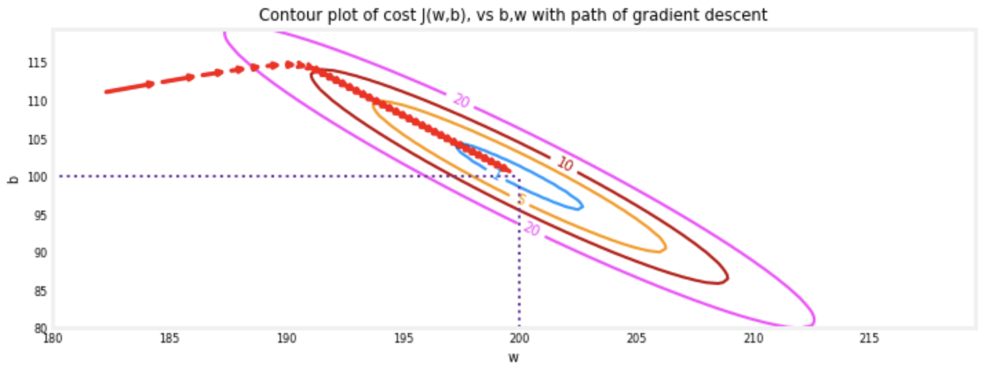

# ML Overview

## Several Main Fields in ML

- Supervised Learning(监督学习)
- Unsupervised Learning(无监督学习)

- Recommender Systems(推荐系统)
- Reinforcement Learning(强化学习)

### 1. Supervised Learning

监督学习是一种机器学习范式，其核心思想是通过**学习带有标签(答案)的数据集来建立输入与输出之间的映射关系，从而能够对未知数据进行预测或分类**。

- 监督学习的细分问题：回归(Regression), 分类(Classification)

#### 回归(Regression)

根据已有的离散数据点，得到一条拟合线，**预测连续的数值结果**。

- 例子：根据已有的房屋面积-房屋价格离散点，得到拟合线，预测新其余面积的对应价格。
- 常用算法：线性回归，支持向量回归，决策树回归，神经网络

#### 分类(Classification)

根据已有有标签的数据，学习它们的特征，将其余没有标签的数据**分配到离散的标签中**。

- 例子：垃圾邮件分类。
- 常用算法：逻辑回归，支持向量机，决策树，随机森林

### 2. Unsupervised Learning

无监督学习用于训练没有标签的数据，**它的目的不是在输入和输出之间建立映射关系，而是为了从数据中自行发现模式或结构，而无需明确的目标输出**。

- 无监督学习的细分问题：聚类(Clustering), 降维(Dimensionality Reduction), 异常检测(Anomaly Detection)

#### 聚类(Clustering)

挖掘数据之间的相似性，将相似的数据分为一组，样本之间的相似性由某种距离度量来衡量。

<!--聚类和分类的区别在于，分类问题是带有标签的，它会将数据分到已有的标签之中；聚类问题是不带标签的，它会挖掘数据之间的相似性，将数据划分为不同的簇。-->

- 例子：用户分组，电商平台根据用户的消费习惯等，将用户分为多个不同的群体。
- 常用算法：K-Means聚类，层次聚类

## Terminologies

### 1. 训练集(Training Set)

用于训练模型的数据集合。

- Input Feature: 使用x代表输入。
- Output Target: 使用y代表输出。
- Training Example: $(x, y)$代表单个训练样本，m代表训练样本总数。通常使用$(x^{(i)}, y^{(i)})$表示第$i^{th}$个训练样本。

_将数据集“喂”给机器学习模型，在Input Features与Output Targets之间建立映射关系f: $f(x^{(i)}) = \hat{y}^{(i)}$. $\hat{y}$是对于y的预测值。_

### 2. 损失函数和成本函数(Loss & Cost Function)

损失函数描述的是对于**单个样本**的误差情况，$loss = (\hat{y_i} - y)^2 = (wx_i + b - y_i)^2$，成本函数描述的是所有样本的误差情况再乘以特定的系数。在机器学习中，先得到损失函数再相加得到成本函数，可以简化问题的思路。成本函数用于描述这个模型的正确性如何，数值越小，正确性越大。

- 成本函数定义: $J_{(w_1, w_2, ..., w_n)}= \frac{1}{2m} \cdot \sum_{i=1}^{m}{{(\hat{y}^{(i)} - y^{(i)})}^2} = \frac{1}{2m} \cdot \sum_{i=1}^{m}{{(f(x^{(i)}) - y^{(i)})}^2}$.

###  3. 梯度下降(Gradient Descent)

梯度下降是一种用于寻找函数最小值的算法。**为了找到使成本函数最小化的参数，梯度下降算法沿着成本函数的梯度负方向不断更新参数，直到损失函数收敛到一个最小值。**值得注意的是，梯度下降算法只能得到**局部最小值**，**这和设置的成本函数的起始参数有关**。

- **梯度下降算法：$w_i = w_i - \alpha \cdot \frac{\partial{J(w_1, w_2, ..., w_n)}}{\partial{w_i}}$**
  - 学习率$\alpha$：梯度下降中的一个参数，决定了每次更新成本函数中参数$w_i$时的步长大小，$\alpha > 0$。
  - 梯度： $\frac{\partial{J(w_1, w_2, ..., w_n)}}{\partial{w_i}}$就是关于某个变量的梯度，表示$J$增长最快的方向。
  - 要求每次同时更新成本函数中的所有参数$w_i$。

- 对于一个固定的$\alpha$，梯度下降算法每次更新的$\Delta{w_i}$会变小，因为$\frac{\partial{J(w_1, w_2, ..., w_n)}}{\partial{w_i}}$会不断变小（在$w_i$不断趋近局部最小值的情况下）。

二维成本函数等高图的梯度下降：



###  4. 学习曲线(Learning Curve)

学习曲线是用于评估模型性能的工具，展现了模型在不同迭代次数，或者不同数据量下的成本误差。一个有效的模型，它的学习曲线应该是单调递减的，并且最终收敛到一个值。


## 多元线性回归

### 1. 定义映射函数

| Size in $Feet^2$ $(x_1)$ | Number of Bedrooms $(x_2)$ | Number of Floors $(x_3)$ | Age of Home in Years $(x_4)$ | Price in $1000's |
| ------------------------ | -------------------------- | ------------------------ | ---------------------------- | ---------------- |
| 2104                     | 5                          | 1                        | 45                           | 460              |
| 1416                     | 3                          | 2                        | 40                           | 232              |
| 1534                     | 3                          | 2                        | 30                           | 315              |
| 852                      | 2                          | 1                        | 36                           | 178              |

- $x_i$：表示第i个特征

- n：表示特征的个数
- $\vec{x}^{(i)}$：表示第i个样本
- $\vec{x}^{(i)}_{j}$：表示第i个样本的第j个特征

定义映射函数：$f_{w_1, w_2, w_3, w_4, b}{(x)} = w_1x_1 + w_2x_2 + w_3x_3 + w_4x_4 + b$.

- $w_i$可以认为是第i个特征的权重(weight)，b可以认为是底价(bias)。

### 2. 向量化(Vectorization)

向量化能够使用计算机中的并行处理，更快地完成训练和预测任务，同时代码更加简洁和易于维护。

- 将权重写成一个行矩阵：$\vec{w}= \begin{bmatrix} w_1 & w_2 & w_3 & w_4 \end{bmatrix}$.
- 将变量x重写为一个列矩阵：$\vec{x} = \begin{bmatrix} x_1 \\ x_2 \\ x_3 \\ x_4\end{bmatrix}$.
- 重新表示映射函数为：$f_{\vec{w}, b}{(\vec{x})} = \vec{w} \cdot \vec{x} + b$.

### 3. 特征缩放(Feature Scaling)

在机器学习中，Feature Scaling指的是对数据中的特征值进行标准化或者归一化，使它们处于同一个数量级范围内，使用特征缩放有以下优势：

- 避免某些特征主导模型：如果有些特征的数值范围远大于其它特征（一个特征范围在0～1，另一个特征范围在0～1000），模型可能会更关注数值变化较大的特征，忽略数值变化较小的特征。
- 加快收敛速度：在使用梯度下降等优化算法时，特征值范围较大可能导致优化路径震荡，从而减慢收敛速度。在二元线性回归中，进行特征放缩之后的等高图类似于一个圆形，直观上更容易收敛到最优值。


特征缩放的两种常见方式：

- 归一化(Normalization)：$x'_i = \frac{x_i - x_{min}}{x_{max} - x_{min}}$ 
- 标准化(Standarization)：$x'_i = \frac{x_i - \mu}{\sigma}, \mu:期望值, \sigma: 标准差$ 

````python
import numpy as np
import random

# 随机生成50个数用于演示。
x = np.array([random.random(0, 101) for _ in range(50)])
# 归一化
x_norm = (x - x.min()) / (x.max() - x.min())
# 标准化
x_stand = (x - x.mean()) / x.std()
````

## Others

### 1. Train-Time Compute & Test-Time Compute

**Train-time compute** 和 **test-time compute** 是机器学习和深度学习中的两个重要概念，主要用于描述模型在训练阶段和测试阶段的计算需求。

#### Train-Time Compute(训练时计算)

训练时计算就是在模型训练过程中进行的计算，包括了前向传播、损失计算、反向传播以及参数更新等步骤。

- 在训练过程中，模型会不断优化参数以减少误差（例如通过梯度下降算法）。这需要大量的计算，尤其是在数据量大、模型复杂时，计算负担更为沉重。
- 训练时计算通常要求较强的计算资源，因为每次迭代都涉及到大量的矩阵运算和梯度计算。

#### Test-Time Compute(测试时计算)

测试时计算是指在模型训练完成后，使用测试数据进行推理（预测）时所进行的计算。此时，模型的参数已经固定，不再进行训练。

- 测试时的计算相对较轻，通常只包括前向传播过程，即给定输入数据，模型计算出输出结果。
- 测试时计算一般要求较低的计算资源，因为没有训练步骤的计算，主要是用于预测。

<!--Test-Time Compute 通过增加推理过程中的计算量（即让模型“思考更久”），能够提高模型在解决较为复杂问题时的表现，而不是通过修改模型的参数来提高准确性。-->
