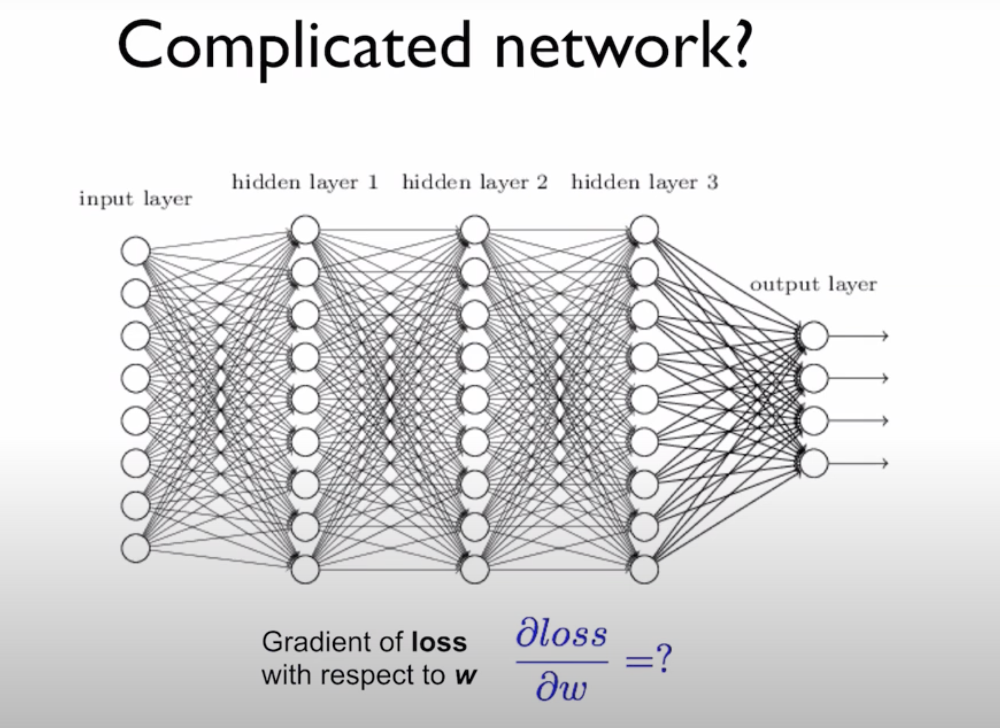
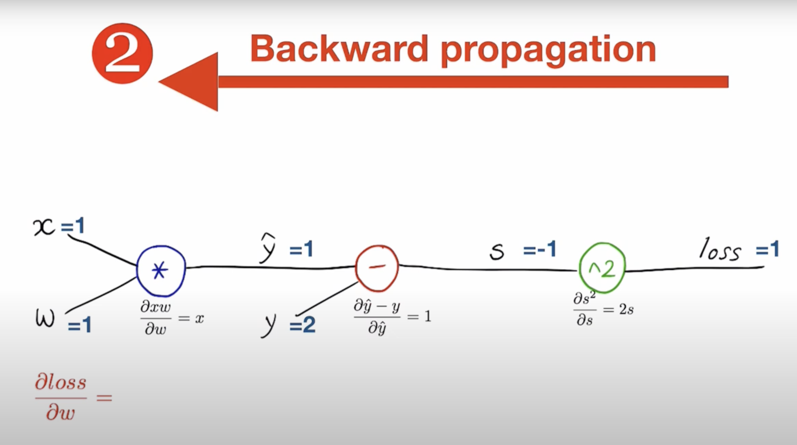

# 链式法则与反向传播

在简单的模型中，计算梯度下降时可以手动写出参数的梯度。但是一旦模型复杂起来，手动写出梯度就会很复杂。计算复杂网络的梯度时，一个更好的方法就是使用链式法则。

- 若 $z = g(y)$ , $y = f(x)$ , 则有 $\frac{\partial z}{\partial x} = \frac{\partial z}{\partial y} \cdot \frac{\partial y}{\partial x} = g' \cdot f'$

## 链式法则 (Chain Rule)

首先可以先画一个思维导图，以 $\hat y = w x$ 为例：

- 首先进行向前传播，得到模型函数和损失函数: $\hat y = w x$ , $loss = {(y - \hat y)}^2$
- 然后运用链式法则，对各个部分进行求导
- 最后进行反向传播 (梯度下降) ，调整 $w$ 

